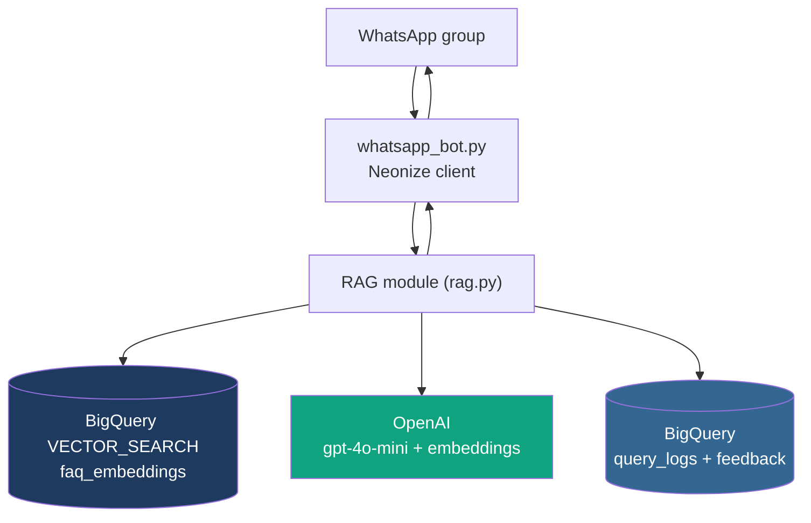
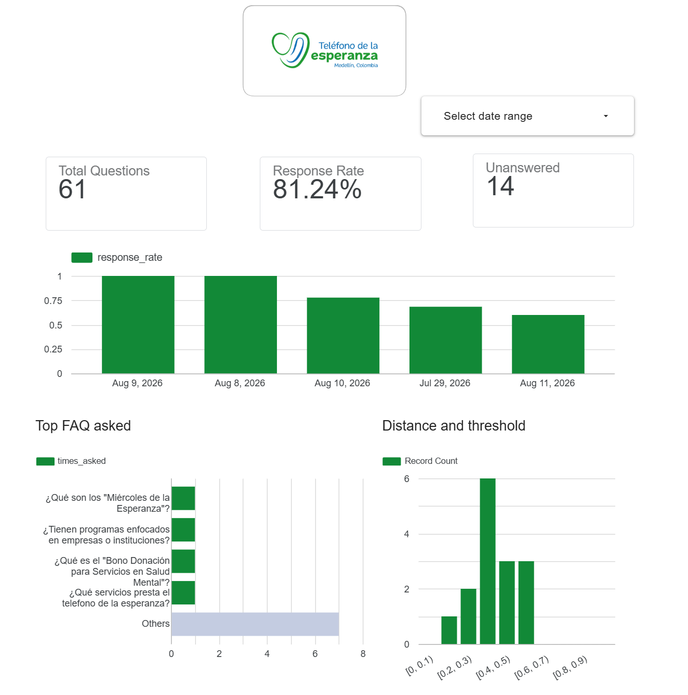

# Crisis lifeline calls WhatsApp FAQ Bot (RAG on BigQuery)

## Project Overview

A WhatsApp group bot that answers FAQ questions about Teléfono de la
Esperanza using retrieval-augmented generation, hosted on GCP. This guide
covers the decisions behind the architecture, full setup from scratch,
and the ongoing workflows (evaluation, feedback, FAQ enrichment).

## Problem Statement

The Telefono de la Esperanza (Phone of Hope) is a non-governmental organization dedicated to mental health. One of its main services is a crisis helpline where people can call for psychological support or simply to be listened to. All calls are answered by an expert who listens and offers advice on next steps. In addition to the crisis hotline, the organization aims to build a community where people can receive help, enroll in educational programs to become volunteers and help others, and take courses to learn how to better understand themselves and others.

In Colombia, WhatsApp is the main communication service, and Telefono de la Esperanza uses it not only to provide psychological guidance but also to publicize current and future courses offered by the organization. People ask the same questions all the time, but the group administrators are sometimes unavailable to answer them. The goal of this project is to create a chatbot for a WhatsApp group that can answer questions based on an FAQ document created by the organization's leaders from past questions and existing documentation.

More information about Telefono de la Esperanza here https://telefonodelaesperanza.org/

## Architecture and Technologies

- **Cloud Platform**: Google Cloud Platform (GCP)
- **Infrastructure as Code**: Terraform
- **Data Warehouse**: BigQuery
- **UI**: Whatsapp through Neonize

## Project Architecture



Everything lives in one GCP project: a dedicated Compute Engine VM runs
the bot process, BigQuery holds both the FAQ vector index and the
question/answer/feedback logs, and OpenAI handles embeddings + generation.

## How it works

```
faq_data.json --build_index.py--> BigQuery table (id, question, answer, embedding)

WhatsApp group message (via Neonize)
  -> rag.retrieve()            [embed question -> BigQuery VECTOR_SEARCH, once]
  -> keyword trigger, or "?" + confident match -> decide whether to respond
  -> rag.log_interaction()     [logs the question + outcome either way - see Query logging]
  -> if responding: rag.generate_answer()   [GPT-4o-mini, using the same retrieved matches]
  -> reply sent back to the group
```

Neonize is a cutting-edge Python library that transforms WhatsApp automation from complex to simple. Built on top of the robust Whatsmeow Go library, it delivers enterprise-grade performance with Python's ease of use and developer-friendly API. More information about Neonize here https://github.com/krypton-byte/neonize

A note on the choice: BigQuery is an analytics warehouse, not a low-latency transactional database, so expect query times in the range of a few hundred milliseconds to a couple of seconds per lookup. My FAQ dataset's size is very small (~ 61 questions to start), this is a fine trade-off if you want everything living in GCP/SQL rather than another service to manage. The decision of using BigQuery resides in a past project where the data pipeline for this organization was hosted in BigQuery, so I wanted to be consistent. More information about the data pipeline here https://github.com/lauosgom/llamatel-crisis-lifeline-pipeline

### Key decisions and why

Reproducing this project means understanding *why* it's built this way,
not just copying commands. These are the load-bearing choices:

| Decision | Choice | Why |
|---|---|---|
| RAG style | Plain (fixed retrieve → generate), not agentic | The FAQ is single-hop by nature — one question maps to one entry. Agentic tool-calling adds latency/cost for query reformulation that a well-tuned `DISTANCE_THRESHOLD` mostly achieves anyway. Revisit only if real-world hit rate turns out poor. |
| Vector store | BigQuery `VECTOR_SEARCH`, not Chroma/Pinecone/Supabase | Deliberate choice to keep everything inside one GCP project/IAM story, even knowing BigQuery has higher query latency than a purpose-built vector DB. Acceptable trade-off at this FAQ's scale. |
| Embedding model | OpenAI `text-embedding-3-small` | Cheaper than Gemini's embedding API at this scale; already using OpenAI for generation, so one vendor instead of two. |
| Embedding content | Combined `"Q: ...\nA: ..."`, not question-only | A/B tested with `evaluate.py`: combined scored `hit_rate=0.992`/`mrr=0.956` vs question-only's `0.926`/`0.895` on 122 synthetic questions. See section 5. |
| Chat model | `gpt-4o-mini` | Cheap, fast, sufficient quality for short FAQ answers. |
| WhatsApp connection | Neonize (unofficial multi-device protocol) | The official WhatsApp Cloud API's Groups feature caps at 8 participants and can't attach to an existing group — a non-starter for a real community group. Neonize logs in as a real WhatsApp account instead. **Trade-off: not a Meta-sanctioned integration — use a secondary number, not a personal one, to limit risk.** |
| Hosting | Dedicated `e2-micro` VM, separate from the existing Prefect VM | Isolation: an always-on unofficial-protocol process (crash/reconnect prone) shouldn't share fate with other production workloads, and e2-micro's 1GB RAM is already tight for one service. |
| Infra as code | Terraform for dataset/tables/views/VM/disk/firewall/NAT | Reproducible, version-controlled infrastructure. |
| Service account & IAM roles | Created and granted **manually**, not by Terraform | Deliberate choice to allow reusing an existing service account and to keep exact permissions visible/auditable rather than implicit in state. |
| Secrets | `.env` file + `python-dotenv`, never hardcoded | Standard practice; `.env` is gitignored. |
| Trigger logic | Keyword (`!faq`/`!ask`) always responds; bare `?` only responds if a confident match exists | Avoids the bot answering every unrelated question in an active group, while still catching natural questions. |
| Logging | `query_logs` (every evaluated question, matched or not) + `feedback` (reactions/admin ratings), both append-only | No sender/group identifying info stored. Unanswered questions are the primary signal for FAQ gaps. Append-only avoids BigQuery's streaming-buffer UPDATE limitations. |

## Setup

### Prerequisites

- A GCP project with billing enabled
- An OpenAI API key
- A secondary WhatsApp-capable phone number (not your personal one)
- `gcloud` CLI installed and authenticated locally
- Terraform installed locally (`terraform -version` ≥ 1.5)
- Python 3.11+ and `git` (the VM's `apt` packages, installed via Cloud NAT — see next section)

All infrastructure (BigQuery dataset/table, the bot VM, disk, firewall) is
managed by Terraform — see **Infrastructure (Terraform)** below for the
full walkthrough, including creating the service account and granting it
access. Come back here once that's done and you have a service account key.

All secrets and config (`OPENAI_API_KEY`, `GCP_PROJECT_ID`,
`GOOGLE_APPLICATION_CREDENTIALS`, etc.) live in a `.env` file rather than
being exported manually or hardcoded. Copy the template and fill it in:
```bash
cp .env.example .env
```
Then edit `.env` with your real values. It's already gitignored, so it
won't end up committed.

## Running the bot

### Clone the repo
```bash
git clone https://github.com/lauosgom/llamatel-crisis-lifeline-chatbot.git
cd llamatel-crisis-lifeline-chatbot
```

### Create the service account (manual, by design — see decision table)
```bash
gcloud iam service-accounts create faq-bot-sa \
  --display-name="WhatsApp FAQ bot service account" \
  --project=YOUR_PROJECT_ID
```
(Skip this if reusing an existing service account — just note its email for the next step.)

### Configure and apply Terraform
```bash
cd terraform
cp terraform.tfvars.example terraform.tfvars
# edit terraform.tfvars: project_id, bot_service_account_email, zone
terraform init
terraform plan
terraform apply
```
This creates: the BigQuery dataset, `faq_embeddings` table, `query_logs`
table, `feedback` table, three dashboard views, `query_logs_with_feedback`
view, the VM (no public IP), its persistent data disk, the IAP-only SSH
firewall rule, and Cloud NAT (required for the VM's outbound internet
access — `apt`/`pip`/`git` all need this, since the VM has no public IP).

### Grant IAM roles (manual, by design)
```bash
gcloud projects add-iam-policy-binding YOUR_PROJECT_ID \
  --member="serviceAccount:faq-bot-sa@YOUR_PROJECT_ID.iam.gserviceaccount.com" \
  --role="roles/bigquery.jobUser"

bq add-iam-policy-binding \
  --member="serviceAccount:faq-bot-sa@YOUR_PROJECT_ID.iam.gserviceaccount.com" \
  --role="roles/bigquery.dataEditor" \
  YOUR_PROJECT_ID:faq_bot
```

### Get the service account key
```bash
terraform output -raw service_account_key_base64 | base64 -d > ../faq-bot-key.json
```
⚠️ This writes key material into Terraform state — treat `terraform.tfstate`
as a secret (remote backend recommended, never commit it).

### SSH into the VM and set up the environment
```bash
$(terraform output -raw ssh_command)   # IAP tunnel, no public IP needed
sudo apt update && sudo apt install -y python3 python3-venv git   # needs Cloud NAT from 4.3
sudo mkdir -p /opt/whatsapp-faq-bot && sudo chown $USER:$USER /opt/whatsapp-faq-bot
git clone https://github.com/lauosgom/llamatel-crisis-lifeline-chatbot.git /opt/whatsapp-faq-bot
```

### Copy secrets onto the VM (not tracked by git)
From your local machine:
```bash
gcloud compute scp .env faq-bot-key.json \
  <vm-name>:/opt/whatsapp-faq-bot/whatsapp_chatbot/ --zone=<zone> --tunnel-through-iap
```
Set `.env` values, with **absolute paths** (relative paths broke things
more than once during setup — see section 8):
```dotenv
OPENAI_API_KEY=sk-...
GCP_PROJECT_ID=your-project-id
BQ_DATASET_ID=faq_bot
BQ_TABLE_ID=faq_embeddings
BQ_QUERY_LOG_TABLE_ID=query_logs
BQ_FEEDBACK_TABLE_ID=feedback
GOOGLE_APPLICATION_CREDENTIALS=/opt/whatsapp-faq-bot/whatsapp_chatbot/faq-bot-key.json
NEONIZE_DB_PATH=/mnt/bot-data/neonize.db
```

### Python environment
```bash
cd /opt/whatsapp-faq-bot/whatsapp_chatbot   # actual code lives one level nested
python3 -m venv /opt/whatsapp-faq-bot/venv
source /opt/whatsapp-faq-bot/venv/bin/activate
pip install -r requirements.txt
```

### Build the FAQ index
If your FAQ source is a CSV: `python csv_to_faq_json.py your_faqs.csv`
first, to produce `faq_data.json`. Then:
```bash
python data/build_index.py
```
Sanity-check before touching WhatsApp at all:
```bash
python whatsapp_chatbot/rag.py "¿Qué es el Teléfono de la Esperanza?"
```

### Find your group's JID and restrict the bot to it
```bash
python settings/find_group_jid.py
```
You will find something like this:
```bash
Group Id llamatel
'LlamaTel test'                          -> User: "123456584582445484"
```
Copy the resulting JID into `ALLOWED_GROUP_JIDS` in `whatsapp_bot.py`. Replace set() for:
```bash
{"123456584582445484g.us"}
```
### First run (interactive QR scan)
```bash
python whatsapp_chatbot/whatsapp_bot.py
```
Scan with your secondary WhatsApp number. Confirm a test question in the
group gets answered, then `Ctrl+C`.

### Install as a systemd service
Edit `terraform/whatsapp-faq-bot.service` — confirm `WorkingDirectory`,
`ExecStart`, `EnvironmentFile` paths match your actual layout, and set
`User` to a real account (`whoami` to check).
```bash
sudo cp whatsapp_chatbot/whatsapp-faq-bot.service /etc/systemd/system/
sudo systemctl daemon-reload
sudo systemctl enable --now whatsapp-faq-bot
sudo systemctl status whatsapp-faq-bot
```
Verify it survives disconnect: close your SSH session, wait a minute,
reconnect, send a test message.

## Evaluation

The FAQ set is small, so evaluation uses an LLM-generated synthetic
ground truth rather than hand-written test questions.

### Generate ground truth
```bash
python evaluation/generate_ground_truth.py
```
Writes `data/ground-truth-retrieval.csv` — for each FAQ entry, a few
realistic paraphrased questions a real person might ask (deliberately
avoiding first-person crisis disclosures as test data, given the domain).
**Read the generated questions before trusting them** — the script prints
a sample; check for repetitive patterns (an earlier run fell into
prefacing every second question with "Espera," — the prompt now
explicitly forbids that, but LLM output in a sensitive domain deserves a
human pass regardless).

### Run retrieval evaluation
```bash
python evaluation/evaluate.py
```
Reports `hit_rate` (did the correct FAQ entry appear in the top-k
results) and `mrr` (mean reciprocal rank — how highly it was ranked when
found), following the standard llm-zoomcamp evaluation pattern.

### A/B test embedding strategies
```bash
python ingestion/build_index.py --embedding-mode combined --table-id faq_embeddings_combined
python ingestion/build_index.py --embedding-mode question_only --table-id faq_embeddings_qonly
python evaluation/evaluate.py --table-id faq_embeddings_combined
python evaluation/evaluate.py --table-id faq_embeddings_qonly
```
Point `.env`'s `BQ_TABLE_ID` at whichever wins, then delete the losing
table (`bq rm -t ...`) so it doesn't linger untracked.


**Results** 
Evaluated 122 questions (top_k=3, table=faq_bot.faq_embeddings_combined): 
hit_rate: 0.992 
mrr:      0.956 

Evaluated 122 questions (top_k=3, table=faq_bot.faq_embeddings_qonly): 
hit_rate: 0.926 
mrr:      0.895 

hit_rate: 0.992. The correct FAQ entry showed up somewhere in the top-3 results for 121 out of 122 test questions.
mrr: 0.956. When it did find the right entry, it was almost always ranked #1 (MRR this close to the hit rate means hits are rarely happening at rank 2 or 3 they're landing right at the top).

Compare that to question-only: 0.926/0.895 is still good, but missing roughly 9 questions instead of 1, and with more of its correct hits buried at rank 2-3 rather than rank 1.

More details and how to run the evaluation framework in evaluation/README.md

## Feedback workflow

Two complementary sources of signal on answer quality:

### Group reactions
Group members react 👍/✅ (good) or 👎/❌ (bad) directly on a bot reply.
Handled automatically in `whatsapp_bot.py`'s `handle_reaction` — no
action needed, it's live once the bot is running.

### Admin review
```bash
python review_logs.py
```
Walks through answered questions with no admin rating yet:
`g`/`b`/`s`/`q` to rate good, bad (with an optional note), skip, or quit.
Re-running only shows what's new since your last pass.

Both write to the same `feedback` table (`source`: `"reaction"` or
`"admin"`), joinable via `query_logs_with_feedback`.

## Generating and ingesting FAQ data

The enrichment loop, end to end:

1. **Find gaps** — query unanswered questions directly, or use the
   `query_logs_daily_stats`/`query_logs_top_faqs` views in Looker Studio:
   ```sql
   SELECT question, distance, timestamp
   FROM `YOUR_PROJECT_ID.faq_bot.query_logs`
   WHERE responded = FALSE
   ORDER BY timestamp DESC;
   ```
2. **Update the source data** — add new entries to `faq_data.json`
   (or edit the source CSV and re-run `csv_to_faq_json.py`).
3. **Rebuild the index**:
   ```bash
   python build_index.py
   ```
   This truncates and reloads the table — safe to re-run any time the
   FAQ doc changes.
4. **Re-evaluate** (section 5) to confirm the new entries don't hurt
   retrieval quality for existing questions.
5. **Deploy**: `git add faq_data.json && git commit && git push`, then on
   the VM: `git pull && python build_index.py` (index rebuild doesn't
   need a bot restart — it's a separate BigQuery write, not something the
   running process caches).


## Dashboard

A very preliminary dashboard can be found here. It has some basic metrics to show how the bot is doing and if it needs any adjustments



Go to https://datastudio.google.com/s/uLkC-0V2mis

## Notes

- Neonize session data lives in `./neonize.db` — deleting it will require
  re-scanning the QR code.
- Costs: each triggered message uses 1 OpenAI embedding call, 1 BigQuery
  query (billed by bytes scanned — negligible at this table size), and 1
  OpenAI chat completion call. All told, fractions of a cent per question.